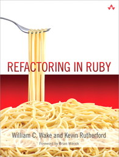

## Testowanie aplikacji w Ruby

<!--
**Luźne uwagi:**

1. Potrzebny jest krótki tytuł. Ten powyżej jest niekompletny.
2. Teraz musimy napisać program w punktach oraz dodać,
maksimum 4–6 pozycji, literatury.
3. [NSS Software Development Fundamentals - Spring 2013][1] –
tutaj jest rozpiska na zajęcia w kolejnych tygodniach zajęć.
Coś takiego trzeba będzie zrobić później. Pewnie w maju lub czerwcu.
4. W sumie nie wiem od czego zacząć: od RSpec? Unit Testing?
5. Na wprowadzenie/powtórkę z Ruby trzeba będzie zaadoptować
to [Learn X in Y minutes][5]. Podobne „starter code”
powinny też być do RSpec (kilka,
np. przykład *hello world*, *RSpec::Expectations*, *RSpec::Mocks*, …).
-->

### Wykład (15 godz.)

1. Powtórka z języka Ruby.
2. Ogólnie o testowaniu, dostępne narzędzia i technologie: 
  MiniTest, RSpec, Capybara, Factory Girl.
3. Wprowadzenie do RSpec.
4. Testy jednostkowe.
5. Testy integracyjne.
6. Obiekty mock i stub.

### Laboratorium (45 godz.)

1. Przygotowanie środowiska do pracy z językiem Ruby: Git, [RVM][2],
  integracja z usługami na GitHub – Travis, Code Climate, Coveralls.
2. Proste skrypty w języku Ruby.
3. Dopisywanie brakującego kodu do nieprzechodzących testów.
4. Dopisywanie testów do niepokrytego nimi kodu.
5. TDD w przykładach (*Test Driven Development*).
6. Własny projekt do napisania z wykorzystaniem TDD lub
   dowolny projekt z [GitHub](github.com) do którego dopisano
   testy (i kod) zaakceptowane przez właściela projektu.

Testing Puzzles:

* [Puzzle Node](http://www.puzzlenode.com/)

Refactoring:

* [Refactoring Notes](http://ghendry.net/refactor.html)

### Literatura

1. David Chelimsky, Dave Astels, Zach Dennis, Aslak Hellesøy, Bryan Helmkamp, Dan North.
   [The RSpec Book: Behaviour-Driven Development with RSpec, Cucumber, and Friends][3].
2. [Better Specs](http://betterspecs.org/).
3. Dokumentacja [RSpec](http://rspec.info/):
  - [rspec-core](https://github.com/rspec/rspec-core)
  - [rspec-expectations](https://github.com/rspec/rspec-expectations)
  - [rspec-mocks](https://github.com/rspec/rspec-mocks)
4. Michael Feathers.
   [Working Effectively with Legacy Code](http://www.amazon.com/Working-Effectively-Legacy-Michael-Feathers/dp/0131177052).

Język Ruby:

1. [Ruby Tutorial][4].
2. [Ruby Koans](http://rubykoans.com/) – Learn Ruby with the Neo Ruby Koans.
3. Jay Fields, Shane Harvie, Martin Fowler with Kent Beck.
   [Refactoring](http://books.google.pl/books/about/Refactoring.html?id=6jyOUrJBJHAC) – Ruby edition.

Testowanie aplikacji:

1. [Rails Testing for Zombies](https://www.codeschool.com/courses/rails-testing-for-zombies) –
  Code School.

[1]: https://github.com/elizabrock/NSS-Syllabus-Spring-2013
[2]: http://rvm.io/rvm
[3]: http://pragprog.com/book/achbd/the-rspec-book
[4]: http://www.tutorialspoint.com/ruby/
[5]: http://learnxinyminutes.com/docs/ruby/
[6]: http://tryruby.org/levels/1/challenges/0
[7]: https://www.codeschool.com/courses/testing-with-rspec
